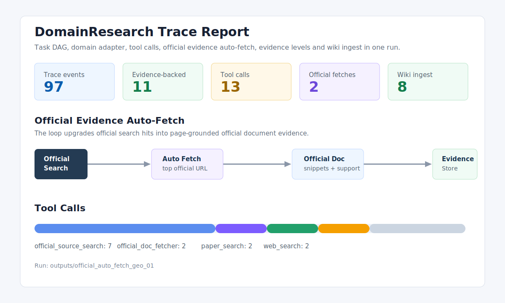
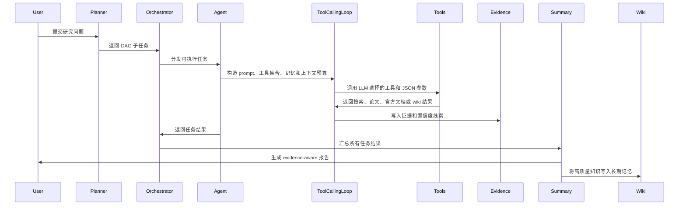
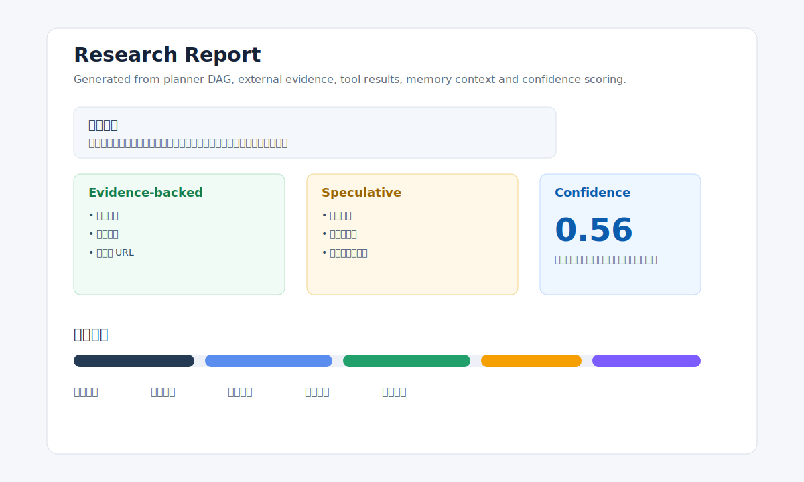

# GeoResearch Agent

GeoResearch Agent 是一个 evidence-aware、domain-adaptive 的 DeepResearch Agent 项目。系统以通用深度研究流程为核心，通过可插拔 Domain Adapter，在同一套架构上支持“通用 DeepResearch”和“专业领域增强 DeepResearch”。GIS/遥感只是内置 demo adapter，后续可以替换成法律、医学、金融、政策研究等其它领域。

它不是单次 LLM 问答，而是把复杂问题拆成 DAG 子任务，通过 Agent tool-calling loop 调用搜索、论文、官方文档、网页浏览、wiki 记忆等工具，最后生成带证据分级和 trace 记录的结构化研究报告。



## 项目目标

普通 LLM 生成研究报告时常见的问题是：内容看起来完整，但来源不清楚、方法是否可靠无法判断、长上下文下容易混入错误信息。这个项目主要解决三个问题：

1. **证据可追踪**：结论尽量关联网页、论文、官方文档或历史 wiki 知识。
2. **上下文可控**：对过长工具结果做预算控制，减少 context rot 和注意力稀释。
3. **领域能力可插拔**：通用模式不绑定具体领域；专业领域通过 Domain Adapter 注入关键词、工具偏好、可信域名、证据规则、输出章节和领域风险检查。

## 核心能力

| 能力 | 说明 |
|---|---|
| Planner DAG | 将复杂研究问题拆解成带依赖关系的子任务。 |
| Orchestrator | 用状态机管理研究流程，调度可执行的 DAG 任务。 |
| Agent 执行器 | 绑定模型 policy、prompt builder、工具注册表、loop 配置、memory adapter 和 trace recorder。 |
| Tool-calling loop | 由 LLM 选择工具和 JSON 参数，由 loop 执行工具、追加上下文并控制终止条件。 |
| 多模型配置 | 用 `providers -> profiles -> module_profiles` 拆分服务商、模型参数和模块路由。 |
| Evidence Store | 记录证据等级、来源层级、URL、置信度线索和被拒绝结论。 |
| 工具结果 compact | 对超预算工具结果做截断或压缩，并保留错误信息与 `[compact]` 标记。 |
| Wiki 长期记忆 | 使用 LLM 结构化 ingest，把高质量报告转成可复用知识。 |
| Trace 可观测性 | 输出 JSONL trace 和 HTML 可视化报告，记录 LLM 调用、usage、工具调用、状态迁移和证据事件。 |
| Domain Adapter Framework | 通过内置或用户声明式 adapter 切换通用 DeepResearch 和专业领域增强 DeepResearch。 |

## 系统架构


## Agent 执行流程



## Demo 输出



一次 GIS/遥感 demo 的 trace 摘要示例：

| 指标 | 示例值 |
|---|---:|
| Trace events | 95 |
| Tool calls | 12 |
| `evidence_backed` 证据项 | 12 |
| `speculative` 证据项 | 4 |
| `rejected` 证据项 | 1 |
| Wiki structured ingest | completed |

报告片段：[docs/demo/sample_report_excerpt.md](docs/demo/sample_report_excerpt.md)

每次运行会在 `outputs/<run-id>/` 下生成：

```text
report_*.md                 # 最终研究报告
trace.jsonl                 # 原始 trace 事件
trace_report.html           # 可视化 trace 报告
progress_events.jsonl       # 面向未来 SSE 前端的进度事件
integration_summary.json    # 本次运行摘要
```

`outputs/` 默认不提交到 Git，只在 `docs/` 中保留经过整理的展示素材。

## 快速开始

```powershell
python -m venv .venv
.\.venv\Scripts\Activate.ps1
python -m pip install -r requirements-minimal.txt
python -m pip install -e . --no-deps
```

如果要启用语义记忆和 wiki 检索，需要安装 ML 依赖：

```powershell
python -m pip install torch --index-url https://download.pytorch.org/whl/cpu
python -m pip install -U sentence-transformers scikit-learn transformers
```

## API Key

复制配置模板：

```powershell
Copy-Item .env.template .env
Copy-Item .env.tools.template .env.local
```

至少配置一个 OpenAI-compatible LLM provider，例如：

```text
DEEPSEEK_API_KEY=your_api_key
DEEPSEEK_BASE_URL=https://api.deepseek.com/v1
DEEPSEEK_MODEL=deepseek-chat
```

搜索工具可根据配置使用 Bocha、SerpAPI、Bing Search 或 Metaso。真实密钥只应写入 `.env` 或 `.env.local`，这两个文件已被 Git 忽略。

## 运行 Demo

通用 DeepResearch：

```powershell
.\.venv\Scripts\python.exe -X utf8 scripts\run_geo_integration_demo.py --preset general
```

GIS/遥感增强 DeepResearch：

```powershell
.\.venv\Scripts\python.exe -X utf8 scripts\run_geo_integration_demo.py --preset geo
```

自定义问题：

```powershell
.\.venv\Scripts\python.exe -X utf8 scripts\run_geo_integration_demo.py --preset geo --query "如何结合 Landsat 和 MODIS 分析城市热岛变化？"
```

自动选择 adapter：

```powershell
.\.venv\Scripts\python.exe -X utf8 scripts\run_geo_integration_demo.py `
  --preset general `
  --adapter auto `
  --query "如何用 Sentinel-2 和 Landsat 数据评估城市扩张对热环境的影响？"
```

指定用户自定义 adapter：

```powershell
.\.venv\Scripts\python.exe -X utf8 scripts\run_geo_integration_demo.py `
  --preset general `
  --adapter climate_policy `
  --user-adapters-dir data/user_adapters `
  --query "请调研 IPCC AR6 中关于城市适应政策的关键结论。"
```

## 配置说明

### Domain Adapter

运行时通过 `domain_adapter` 决定专业领域增强逻辑：

```yaml
domain_adapter:
  mode: "general"
  user_adapters_dir: "data/user_adapters"
```

内置 adapter：

| Adapter | 用途 |
|---|---|
| `general` | 通用深度研究，不注入特定领域规则。 |
| `geo_remote_sensing` | GIS/遥感增强，注入数据约束、官方域名、方法验证规则和风险清单。 |

`geo_remote_sensing` 会额外要求报告覆盖：

- 研究约束抽取：AOI、时间范围、目标变量、候选传感器、方法需求。
- 数据候选表：数据集、用途、空间分辨率、时间覆盖、获取方式、官方来源。
- 数据-方法适配矩阵：方法、数据条件、候选数据是否支持、不支持原因、风险。
- GIS/RS 风险清单：云量、CRS、尺度错配、季节一致性、混合像元、热红外限制。

### 创建用户 Adapter

Level 1：使用 LLM 根据一句话描述生成 adapter 草稿：

```powershell
.\.venv\Scripts\python.exe -X utf8 scripts\create_domain_adapter.py `
  --name climate_policy `
  --display-name "Climate Policy" `
  --description "面向气候政策、IPCC 报告、国际组织文件和政策证据的深度研究 adapter。"
```

Level 2：手动填写字段，适合没有可用 LLM 或想精确控制 adapter 的情况：

```powershell
.\.venv\Scripts\python.exe -X utf8 scripts\create_domain_adapter.py `
  --manual `
  --name climate_policy `
  --display-name "Climate Policy" `
  --description "Climate policy research." `
  --keywords "climate policy,IPCC,UNFCCC" `
  --preferred-domains "ipcc.ch,unfccc.int" `
  --recommended-tools "official_source_search,official_doc_fetcher,paper_search,web_search" `
  --evidence-rules "Prefer official reports and standards bodies,Separate policy claims from interpretation" `
  --output-sections "Policy source table,Evidence summary,Risk and uncertainty"
```

生成的 YAML 位于 `data/user_adapters/<adapter_id>.yaml`。该目录默认不提交到 Git，避免把个人实验配置混入项目源码。

### 输出语言

```yaml
output:
  language: "zh-CN"
```

当前支持 `zh-CN` 和 `en-US`。该配置会传入 researcher prompt、summarizer prompt 和 wiki ingest prompt。

### 三层模型配置

```yaml
model:
  default_profile: "solver"

  providers:
    deepseek:
      adapter: "openai_compatible"
      env_prefix: "DEEPSEEK"
      default_model: "deepseek-chat"
      default_base_url: "https://api.deepseek.com/v1"

  profiles:
    planner:
      provider: "deepseek"
      model: "deepseek-chat"
      temperature: 0.2
      max_tokens: 4096
    solver:
      provider: "deepseek"
      model: "deepseek-chat"
      temperature: 0.5
      max_tokens: 4096
    summarizer:
      provider: "deepseek"
      model: "deepseek-chat"
      temperature: 0.2
      max_tokens: 8192

  module_profiles:
    planner: "planner"
    researcher: "solver"
    summarizer: "summarizer"
```

这套配置将三类信息分开：

- `providers`：API 服务商、adapter、环境变量前缀、默认模型和 base URL。
- `profiles`：模型名、temperature、top_p、max_tokens 等调用参数。
- `module_profiles`：planner、researcher、summarizer 等模块使用哪个 profile。

## 测试

```powershell
.\.venv\Scripts\python.exe -X utf8 -m unittest discover -s tests/unit -p "test_*.py"
.\.venv\Scripts\python.exe -X utf8 -m compileall -q src tests
```

当前测试覆盖模型配置、domain adapter、prompt builder、工具结果 compact、证据来源分级、搜索结果排序、官方文档获取、trace 记录、wiki store 和 summarizer confidence 等关键模块。
