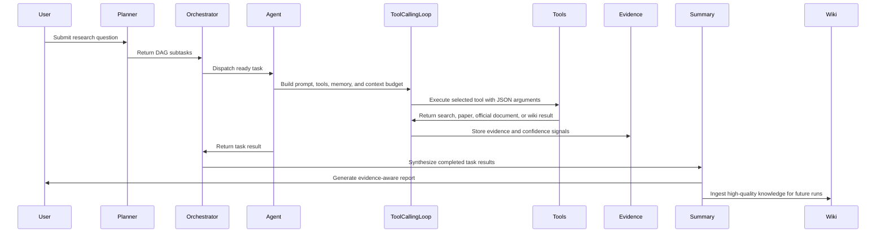

# GeoResearch Agent

GeoResearch Agent is an evidence-aware DeepResearch system. It starts from a general-purpose research agent architecture, then adds configurable domain profiles so the same core workflow can run as either a general DeepResearch assistant or a GIS/remote-sensing enhanced research assistant.

The system decomposes a complex question into DAG tasks, executes tool-calling agents, collects external evidence, tracks confidence, writes trace logs, and generates a structured research report.


## Why This Project

LLM-generated research reports often look fluent but are hard to trust. This project focuses on three practical problems:

1. **Evidence grounding**: claims should be linked to web pages, papers, official sources, or prior wiki knowledge.
2. **Context control**: long tool results need budget control to reduce context rot and attention dilution.
3. **Domain constraints**: GIS/remote-sensing research must check AOI, time range, sensor, bands, resolution, CRS, cloud cover, validation strategy, and method-data compatibility.

## Core Capabilities

| Capability | Description |
|---|---|
| Planner DAG | Decomposes a research query into dependent subtasks. |
| Orchestrator | Runs a state-machine workflow and schedules ready DAG tasks. |
| Agent executor | Binds model policy, prompt builder, tool registry, loop config, memory adapter, and trace recorder. |
| Tool-calling loop | Lets the LLM choose tools and JSON arguments, executes tools, appends results, and controls termination. |
| Multi-model config | Uses `providers -> profiles -> module_profiles` to decouple vendors, model parameters, and module routing. |
| Evidence store | Tracks evidence level, source tier, URLs, confidence signals, and rejected claims. |
| Tool result compact | Truncates or compacts oversized tool outputs while preserving error messages and `[compact]` markers. |
| Wiki memory | Uses LLM-based structured ingest to convert high-quality reports into reusable wiki knowledge. |
| Trace report | Records LLM calls, usage, tool calls, state transitions, evidence events, and wiki ingest into JSONL and HTML. |
| Domain profiles | Switches between general DeepResearch and GIS/RS-enhanced research by configuration. |

## Architecture


## Agent Workflow



## Demo Output


Example trace summary from a GIS/RS run:

| Metric | Example |
|---|---:|
| Trace events | 95 |
| Tool calls | 12 |
| `evidence_backed` items | 12 |
| `speculative` items | 4 |
| `rejected` items | 1 |
| Wiki structured ingest | completed |

Report excerpt: [docs/demo/sample_report_excerpt.md](docs/demo/sample_report_excerpt.md)

A run writes the following artifacts to `outputs/<run-id>/`:

```text
report_*.md                 # final research report
trace.jsonl                 # raw trace events
trace_report.html           # visual trace dashboard
progress_events.jsonl       # progress events for future SSE integration
integration_summary.json    # run summary
```

`outputs/` is intentionally ignored by Git. The repository only keeps selected, sanitized demo assets under `docs/`.

## Quick Start

```powershell
python -m venv .venv
.\.venv\Scripts\Activate.ps1
python -m pip install -r requirements-minimal.txt
python -m pip install -e . --no-deps
```

For semantic memory and wiki retrieval, install the ML dependencies:

```powershell
python -m pip install torch --index-url https://download.pytorch.org/whl/cpu
python -m pip install -U sentence-transformers scikit-learn transformers
```

## API Keys

Copy the templates:

```powershell
Copy-Item .env.template .env
Copy-Item .env.tools.template .env.local
```

Configure at least one OpenAI-compatible LLM provider:

```text
DEEPSEEK_API_KEY=your_api_key
DEEPSEEK_BASE_URL=https://api.deepseek.com/v1
DEEPSEEK_MODEL=deepseek-chat
```

Search tools can use providers such as Bocha, SerpAPI, Bing Search, or Metaso, depending on the selected YAML config. Real keys must stay in `.env` or `.env.local`; both files are ignored by Git.

## Run Demos

General DeepResearch:

```powershell
.\.venv\Scripts\python.exe -X utf8 scripts\run_geo_integration_demo.py --preset general
```

GIS/remote-sensing enhanced research:

```powershell
.\.venv\Scripts\python.exe -X utf8 scripts\run_geo_integration_demo.py --preset geo
```

Custom query:

```powershell
.\.venv\Scripts\python.exe -X utf8 scripts\run_geo_integration_demo.py --preset geo --query "How can Landsat and MODIS be combined for urban heat island analysis?"
```

## Configuration

### Output Language

```yaml
output:
  language: "zh-CN"
```

Supported values include `zh-CN` and `en-US`. The setting is passed into researcher prompts, summarizer prompts, and wiki ingest prompts.

### Three-layer Model Configuration

```yaml
model:
  default_profile: "solver"

  providers:
    deepseek:
      adapter: "openai_compatible"
      env_prefix: "DEEPSEEK"
      default_model: "deepseek-chat"
      default_base_url: "https://api.deepseek.com/v1"

  profiles:
    planner:
      provider: "deepseek"
      model: "deepseek-chat"
      temperature: 0.2
      max_tokens: 4096
    solver:
      provider: "deepseek"
      model: "deepseek-chat"
      temperature: 0.5
      max_tokens: 4096
    summarizer:
      provider: "deepseek"
      model: "deepseek-chat"
      temperature: 0.2
      max_tokens: 8192

  module_profiles:
    planner: "planner"
    researcher: "solver"
    summarizer: "summarizer"
```

This separates:

- `providers`: API vendor, adapter type, env prefix, default model, and base URL.
- `profiles`: model name and sampling parameters.
- `module_profiles`: which profile is used by planner, researcher, summarizer, and other modules.

## Tests

```powershell
.\.venv\Scripts\python.exe -X utf8 -m unittest discover -s tests/unit -p "test_*.py"
.\.venv\Scripts\python.exe -X utf8 -m compileall -q src tests
```

Current unit tests cover model factory configuration, domain profiles, prompt building, tool result compacting, evidence source tiers, web-search ranking, official document fetching, trace recording, wiki store behavior, and summarizer confidence logic.
