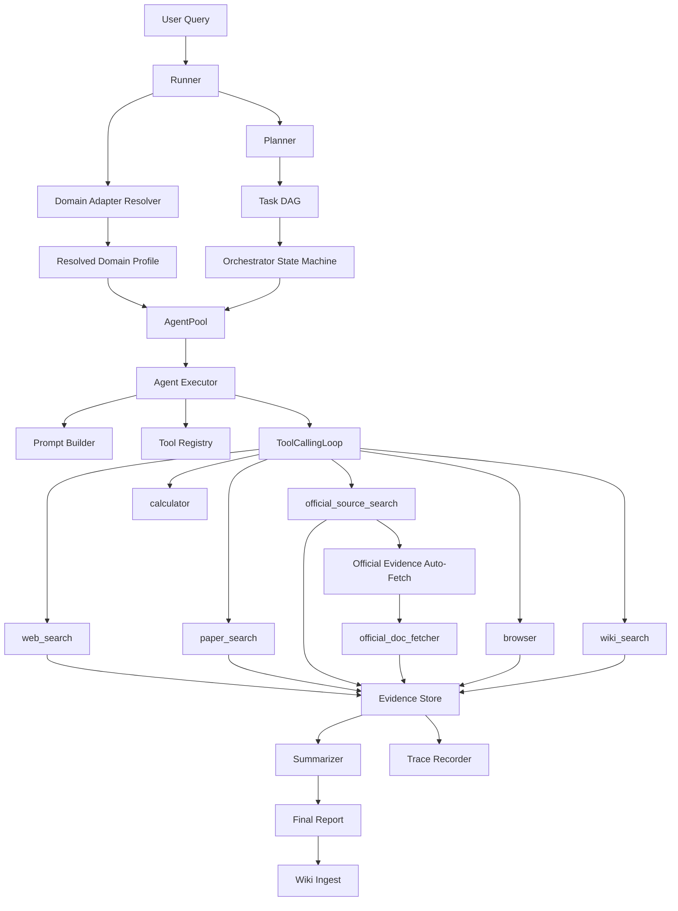
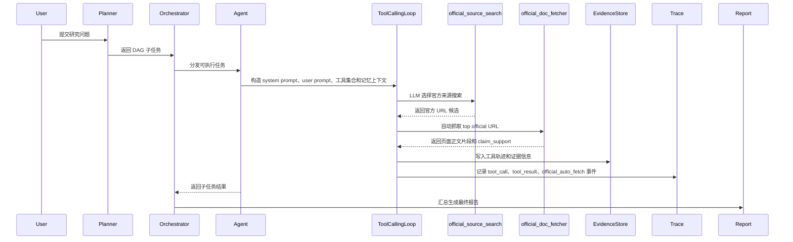

# DomainResearch Agent

DomainResearch Agent 是一个 **evidence-aware、domain-adaptive** 的 DeepResearch Agent 项目。它不是只给某个领域追加 prompt，而是把通用深度研究流程抽象成一套可扩展框架：

- 通用问题走 Core DeepResearch 流程。
- 专业领域通过 **Domain Adapter** 注入领域关键词、工具偏好、可信来源、证据规则和输出结构。
- 官方来源搜索结果会自动升级为页面级官方证据，进入 evidence store 和 trace 可视化。

GIS/遥感只是内置示例 adapter。金融、气候政策、医疗指南、标准规范、公司研究等领域可以用同一套机制扩展。


## 核心亮点

| 能力 | 说明 |
|---|---|
| Planner DAG | 将复杂研究问题拆成带依赖关系的子任务 DAG。 |
| Orchestrator | 用状态机调度 DAG，基于 asyncio 控制并发执行。 |
| Agent Executor | 每个 agent 绑定 policy、prompt builder、tool registry、loop config、memory adapter 和 trace recorder。 |
| ToolCallingLoop | 负责 messages、tool calls、工具执行、终止条件、结果 compact 和 trace。 |
| Domain Adapter | 领域能力插件化：注入关键词、工具集合、官方域名、证据规则和报告结构。 |
| Official Evidence Auto-Fetch | `official_source_search` 命中官方 URL 后，自动调用 `official_doc_fetcher` 抽取页面级证据。 |
| Evidence Store | 按来源质量和工具轨迹标注 `verified`、`evidence_backed`、`speculative`、`rejected`。 |
| Wiki Memory | 把高质量报告通过 LLM 结构化 ingest 到本地 wiki，供后续任务复用。 |
| Trace 可观测性 | 输出 JSONL trace 和 HTML 报告，展示 DAG、工具调用、usage、证据等级、compact 和 wiki ingest。 |
| 多模型配置 | 使用 `providers -> profiles -> module_profiles` 三层结构，为 planner、researcher、summarizer 等模块配置不同模型。 |

## 架构



## Agent 执行流程



## Domain Adapter 机制

Domain Adapter 负责把“专业领域”变成可插拔配置，而不是把领域逻辑写死在主流程里。一个 adapter 可以定义：

- `keywords`：用于 `--adapter auto` 时自动匹配领域。
- `exposed_tools` / `recommended_tools`：控制该领域可以使用和优先使用的工具。
- `preferred_official_domains`：官方来源偏好，例如 `usgs.gov`、`sec.gov`、`ipcc.ch`。
- `evidence_checklist`：领域证据规则，例如“数据集参数必须查官方文档”。
- `output_sections`：领域报告结构，例如“数据候选表”“风险清单”“方法验证矩阵”。
- `extends`：继承通用 adapter，避免重复声明通用工具和规则。

当前内置 adapter：

| Adapter | 作用 |
|---|---|
| `general` | 通用 DeepResearch，不注入特定领域假设。 |
| `geo_remote_sensing` | GIS/遥感增强，注入遥感数据规则、官方数据源、方法验证和风险检查。 |

运行时选择 adapter：

```powershell
.\.venv\Scripts\python.exe -X utf8 scripts\run_geo_integration_demo.py --preset general --adapter general
.\.venv\Scripts\python.exe -X utf8 scripts\run_geo_integration_demo.py --preset geo --adapter geo_remote_sensing
.\.venv\Scripts\python.exe -X utf8 scripts\run_geo_integration_demo.py --preset general --adapter auto --query "如何用 Landsat 研究城市热岛？"
```

## 如何扩展新领域

项目支持两种扩展方式。

### 方式一：用户声明式 Adapter

适合快速创建一个新领域，不需要改源码。生成结果是 `data/user_adapters/<adapter_id>.yaml`。

#### Level 1：LLM 快速生成

只提供领域 id、展示名和一句话描述，让 LLM 生成第一版 adapter 草稿。

```powershell
.\.venv\Scripts\python.exe -X utf8 scripts\create_domain_adapter.py `
  --name climate_policy `
  --display-name "Climate Policy" `
  --description "面向气候政策、IPCC 报告、国际组织文件和政策证据的深度研究 adapter。"
```

适合场景：

- 快速验证某个新领域是否能接入。
- 先得到一版可运行配置，再人工微调。
- 面试展示“用户可自定义专业领域”的能力。

#### Level 2：手动字段填写

手动指定关键词、可信域名、推荐工具、证据规则和输出结构。

```powershell
.\.venv\Scripts\python.exe -X utf8 scripts\create_domain_adapter.py `
  --manual `
  --name finance_research `
  --display-name "Finance Research" `
  --description "Financial market, public company, macroeconomic, and regulatory research." `
  --keywords "finance,stock,earnings,SEC,10-K,10-Q,Federal Reserve,macro,valuation,risk" `
  --preferred-domains "sec.gov,federalreserve.gov,treasury.gov,bls.gov,bea.gov" `
  --recommended-tools "official_source_search,official_doc_fetcher,web_search,paper_search,calculator" `
  --evidence-rules "Prefer official filings and regulators,Flag stale market data,Separate facts from investment interpretation" `
  --output-sections "Financial facts table,Source and filing table,Risk and uncertainty,Investment interpretation boundaries"
```

适合场景：

- 你已经知道这个领域应该信哪些官方来源。
- 需要稳定复现，而不是依赖 LLM 每次生成。
- 希望精确控制报告结构。

运行用户 adapter：

```powershell
.\.venv\Scripts\python.exe -X utf8 scripts\run_geo_integration_demo.py `
  --preset general `
  --adapter finance_research `
  --user-adapters-dir data/user_adapters `
  --query "请分析苹果公司最近一个财年的收入结构、主要风险和监管披露重点。"
```

说明：金融 adapter 已验证“快速创建、保存、加载、运行”的链路。当前版本还没有 SEC EDGAR 专用 connector，所以高质量金融研究仍属于后续 Official Evidence Layer 的扩展方向。

### 方式二：内置代码 Adapter

适合把一个领域沉淀为项目内置能力。它需要改源码，但可维护性更强，适合长期展示或产品化。

步骤：

1. 新增 adapter 文件，例如：

```text
src/domain_adapters/builtin/medical_guidelines.py
```

2. 继承 `StaticProfileAdapter`：

```python
from src.domain_adapters.base import DomainAdapterMetadata, StaticProfileAdapter

MEDICAL_GUIDELINES_PROFILE = {
    "extends": "general",
    "recommended_tools": [
        "official_source_search",
        "official_doc_fetcher",
        "paper_search",
        "web_search",
    ],
    "preferred_official_domains": [
        "who.int",
        "cdc.gov",
        "nih.gov",
    ],
    "evidence_checklist": [
        "Prefer official clinical guidelines and public health agencies.",
        "Separate guideline recommendations from interpretation.",
        "Flag date-sensitive or region-specific claims.",
    ],
    "output_sections": [
        "Guideline source table",
        "Evidence summary",
        "Risks and limitations",
    ],
}

class MedicalGuidelinesAdapter(StaticProfileAdapter):
    def __init__(self) -> None:
        super().__init__(
            metadata=DomainAdapterMetadata(
                name="medical_guidelines",
                display_name="Medical Guidelines",
                description="Evidence-aware research over medical guidelines.",
                keywords=("medical guideline", "WHO", "CDC", "NIH"),
            ),
            profile=MEDICAL_GUIDELINES_PROFILE,
        )
```

3. 在 `src/domain_adapters/builtin/__init__.py` 导出新类。

4. 在 `src/domain_adapters/registry.py` 的 `ensure_builtins()` 中注册。

5. 补单元测试，确认：

- `AdapterRegistry.get("medical_guidelines")` 可用。
- `--adapter auto` 能根据关键词匹配。
- `resolve_domain_profile()` 能合并 `extends=general` 的工具和规则。

这种方式适合 GIS/遥感这类你希望长期维护、在 README 里重点展示的领域。

## Official Evidence Auto-Fetch

当前版本已经实现一个轻量但有效的官方证据闭环：

```text
official_source_search
  -> 找到官方 URL
  -> ToolCallingLoop 自动调用 official_doc_fetcher
  -> 抽取官方页面正文片段
  -> 写入 trajectory 和 trace
  -> EvidenceStore 识别为 official_doc evidence
```

默认配置：

```yaml
agents:
  researcher:
    tool_loop:
      auto_fetch_official_docs: true
      auto_fetch_official_max_urls: 1
      auto_fetch_official_timeout_seconds: 12
      auto_fetch_official_max_chars: 6000
      auto_fetch_official_max_snippets: 3
```

这不是完整的 Official Evidence Layer，但已经避免了“只把搜索摘要当证据”的问题。后续可以继续扩展：

- `sec_edgar`：SEC 10-K / 10-Q / 8-K 文件检索与解析。
- `government_site`：政府法规、统计发布、白皮书。
- `standards_org`：标准组织文档。
- `company_ir`：公司年报、投资者关系材料。
- `product_docs`：技术文档、API 文档、数据集说明。

## Demo 结果


最近一轮 GIS/RS demo：

| 指标 | 结果 |
|---|---:|
| Trace events | 97 |
| Task success | 4 / 4 |
| Tool calls | 13 |
| `official_source_search` | 7 |
| `official_doc_fetcher` | 2 |
| `paper_search` | 2 |
| `evidence_backed` | 11 |
| `speculative` | 2 |
| Wiki structured ingest | 8 pages |

输出目录示例：

```text
outputs/official_auto_fetch_geo_01/
  report_*.md
  trace.jsonl
  trace_report.html
  progress_events.jsonl
  integration_summary.json
```

## 快速开始

```powershell
python -m venv .venv
.\.venv\Scripts\Activate.ps1
python -m pip install -r requirements-minimal.txt
python -m pip install -e . --no-deps
```

如果要启用语义记忆和 wiki 检索：

```powershell
python -m pip install torch --index-url https://download.pytorch.org/whl/cpu
python -m pip install -U sentence-transformers scikit-learn transformers
```

## API Key

复制配置模板：

```powershell
Copy-Item .env.template .env
Copy-Item .env.tools.template .env.local
```

至少配置一个 OpenAI-compatible LLM provider，例如：

```text
DEEPSEEK_API_KEY=your_api_key
DEEPSEEK_BASE_URL=https://api.deepseek.com/v1
DEEPSEEK_MODEL=deepseek-chat
```

搜索工具可以使用 Bocha、SerpAPI、Bing Search 或 Metaso。真实密钥只应写入 `.env` 或 `.env.local`，不要提交到 GitHub。

## 运行 Demo

通用 DeepResearch：

```powershell
.\.venv\Scripts\python.exe -X utf8 scripts\run_geo_integration_demo.py --preset general
```

GIS/遥感增强 DeepResearch：

```powershell
.\.venv\Scripts\python.exe -X utf8 scripts\run_geo_integration_demo.py --preset geo
```

指定输出目录：

```powershell
.\.venv\Scripts\python.exe -X utf8 scripts\run_geo_integration_demo.py `
  --preset geo `
  --output-dir outputs\demo_geo_showcase_01
```

## 多模型配置

模型配置分三层：

```yaml
model:
  providers:
    deepseek:
      adapter: "openai_compatible"
      base_url_env: "DEEPSEEK_BASE_URL"
      api_key_env: "DEEPSEEK_API_KEY"
  profiles:
    planner:
      provider: "deepseek"
      model: "deepseek-chat"
      temperature: 0.2
  module_profiles:
    planner: "planner"
    solver: "solver"
    summarizer: "summarizer"
```

面试时可以这样讲：

> provider 管 API 服务商、base_url 和密钥；profile 管模型名、temperature、max_tokens 等参数；module_profiles 决定 planner、researcher、summarizer 等模块使用哪个 profile。这样可以让不同模块使用不同模型，同时避免把 API key 和模块逻辑耦合在一起。

## 测试

全量单测：

```powershell
.\.venv\Scripts\python.exe -X utf8 -m unittest discover -s tests\unit -p "test_*.py"
```

常用 targeted tests：

```powershell
.\.venv\Scripts\python.exe -X utf8 -m unittest `
  tests.unit.test_domain_adapters `
  tests.unit.test_create_domain_adapter `
  tests.unit.test_tool_calling_loop_trace `
  tests.unit.test_tool_profiles
```

最近验证结果：

```text
129 tests OK
general demo: official_doc_fetcher = 5
GIS/RS demo: official_doc_fetcher = 2
```

## 当前边界

- 当前官方证据能力是“官方来源自动升级”，不是完整 SEC / PDF / XBRL / 表格级官方文档系统。
- 用户 adapter 可以快速扩展领域，但高质量专业研究仍需要为关键来源补 connector。
- `outputs/`、`data/`、`.env`、`.env.local` 不应提交到 GitHub。
