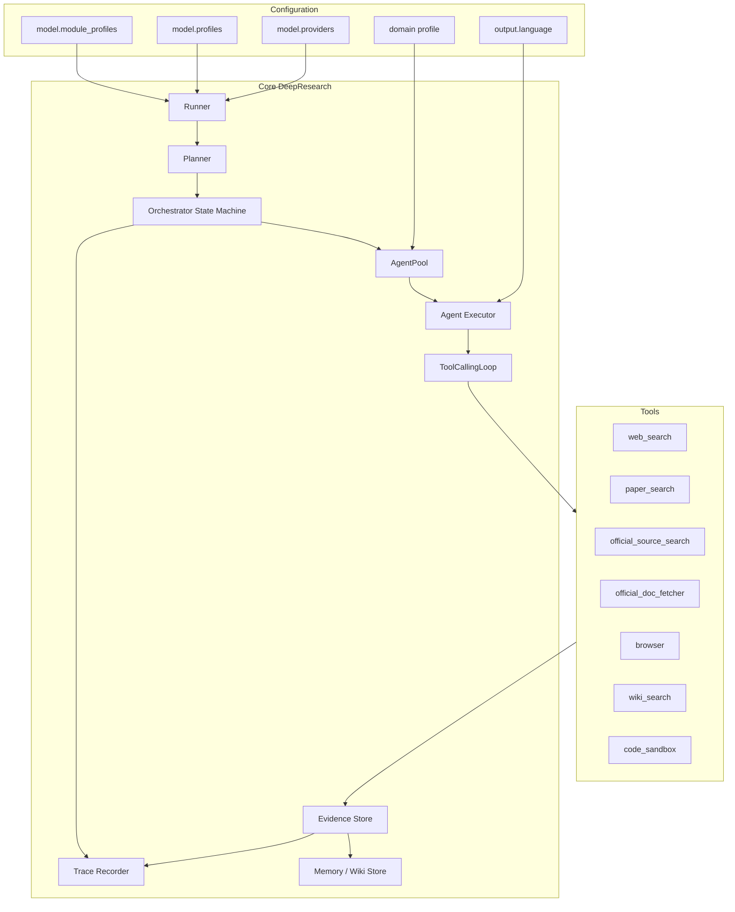

# GeoResearch Agent

面向面试展示的 DeepResearch Agent 项目：以通用深度研究为核心，通过 domain profile 动态增强 GIS/遥感研究能力。系统不是简单问答机器人，而是把复杂问题拆成 DAG 子任务，并通过工具调用、外部证据检索、长期记忆、trace 可观测性和证据分级，生成可追踪的研究报告。


## 项目定位

这个项目的核心目标是解决普通 LLM 研究报告常见的三个问题：

1. **缺少外部证据**：模型容易凭记忆生成看似合理但不可追踪的结论。
2. **上下文不可控**：多轮搜索后工具结果会堆积，导致注意力稀释和错误复用。
3. **领域约束不足**：GIS/遥感任务需要检查 AOI、时间范围、传感器、波段、分辨率、CRS、云量和验证方案。

GeoResearch Agent 的设计思路是：

```mermaid
flowchart LR
    Q["User Query"] --> P["Planner"]
    P --> D["DAG SubTasks"]
    D --> O["Orchestrator"]
    O --> A["Agent Pool"]
    A --> L["Tool Calling Loop"]
    L --> T["Search / Paper / Official / Browser / Wiki Tools"]
    T --> E["Evidence Store"]
    E --> S["Summarizer"]
    S --> R["Evidence-aware Report"]
    R --> W["Wiki Ingest"]
    W --> M["Long-term Memory"]
```



## 主要功能

| 功能 | 说明 |
|---|---|
| Planner DAG | 将复杂研究问题拆解为有依赖关系的子任务，Orchestrator 按 DAG 调度执行 |
| AgentPool + Agent 执行器 | 池化的是绑定好 policy、prompt builder、tool registry、loop config、context compressor、memory adapter 的执行器 |
| Tool-calling loop | LLM 负责选择工具和参数，loop 负责执行工具、保存上下文、处理终止条件和错误状态 |
| 多模型配置 | 通过 `providers -> profiles -> module_profiles` 三层配置，把 API 服务商、模型参数和模块路由分开 |
| 外部证据工具 | 支持 web search、paper search、official source search、official doc fetcher、browser、calculator、code sandbox、wiki search |
| 证据分级 | 对结论标记 `verified`、`evidence_backed`、`speculative`、`rejected`，避免报告把推断伪装成事实 |
| Context compact | 对工具返回和最终合成输入做预算控制，保留错误信息并标记 `[compact]` |
| 长期记忆 / Wiki | 把高质量报告通过 LLM 结构化提取后写入 wiki store，后续查询可通过 `wiki_search` 复用 |
| JSONL Trace + HTML 报告 | 每次运行记录状态迁移、LLM 调用、工具调用、usage、证据项、wiki ingest 等事件 |
| 通用 + GIS/RS Profile | 通用模式默认启用通用工具；GIS/遥感模式通过 prompt sections、preferred domains 和专用检查清单增强 |

## 架构图



## Agent 执行流程

```mermaid
sequenceDiagram
    participant User
    participant Planner
    participant Orchestrator
    participant Agent
    participant Loop as ToolCallingLoop
    participant Tools
    participant Evidence
    participant Summary
    participant Wiki

    User->>Planner: 输入研究问题
    Planner->>Orchestrator: 返回 DAG 子任务
    Orchestrator->>Agent: 分配可执行 task
    Agent->>Loop: 构造 system prompt、工具集合、上下文预算
    Loop->>Tools: LLM 选择工具并传入 JSON 参数
    Tools->>Loop: 返回搜索/论文/官方文档/网页结果
    Loop->>Evidence: 写入证据项和置信度线索
    Agent->>Orchestrator: 返回 task result
    Orchestrator->>Summary: 汇总 DAG 结果
    Summary->>User: 生成 evidence-aware report
    Summary->>Wiki: 高质量报告进入 LLM 结构化 ingest
```

## Demo 展示


一次 GIS/遥感 demo 的 trace 摘要示例：

| 指标 | 示例值 |
|---|---:|
| Trace events | 95 |
| Tool calls | 12 |
| `evidence_backed` | 12 |
| `speculative` | 4 |
| `rejected` | 1 |
| Wiki structured ingest | completed |

报告片段见：[docs/demo/sample_report_excerpt.md](docs/demo/sample_report_excerpt.md)

真实运行产物会写入 `outputs/<run-id>/`，包含：

```text
report_*.md                 # 最终研究报告
trace.jsonl                 # 原始 trace 事件
trace_report.html           # 可视化 trace 报告
progress_events.jsonl       # 面向前端 SSE 的进度事件
integration_summary.json    # 本次运行摘要
```

`outputs/` 默认不提交。展示给面试官时建议只提交精选截图、SVG 图或经过脱敏的 demo 片段。

## 通用模式与 GIS/RS 模式

### 通用 DeepResearch

通用模式适合技术调研、产品调研、论文背景调研、API 文档调研等任务。它不会强制加入 GIS/遥感规则。

```powershell
.\.venv\Scripts\python.exe -X utf8 scripts\run_geo_integration_demo.py `
  --query "Python asyncio 中 task cancellation 的官方语义是什么？请结合官方文档和实践风险说明。" `
  --config configs\default.yaml `
  --output-dir outputs\general_demo_01 `
  --user-id demo-general `
  --session-id general-demo-01 `
  --run-id general-demo-01 `
  --log-level INFO
```

### GIS/遥感增强模式

GIS/遥感模式会动态加入领域 prompt sections、preferred domains 和遥感风险检查清单，适合城市热岛、土地利用变化、遥感数据选择、方法验证等问题。

```powershell
.\.venv\Scripts\python.exe -X utf8 scripts\run_geo_integration_demo.py `
  --query "如何研究 2018-2024 年武汉城市扩张对地表热环境的影响？请给出数据选择、方法流程、验证方案和潜在风险。" `
  --config configs\geo_real_search.yaml `
  --output-dir outputs\geo_demo_01 `
  --user-id demo-geo `
  --session-id geo-demo-01 `
  --run-id geo-demo-01 `
  --log-level INFO
```

## 配置说明

### 输出语言

```yaml
output:
  language: "zh-CN"
```

当前支持 `zh-CN` 和 `en-US`。配置会传入 researcher prompt、summarizer prompt 和 wiki ingest prompt。

### 三层模型配置

```yaml
model:
  default_profile: "solver"

  providers:
    deepseek:
      adapter: "openai_compatible"
      env_prefix: "DEEPSEEK"
      default_model: "deepseek-chat"
      default_base_url: "https://api.deepseek.com/v1"

  profiles:
    planner:
      provider: "deepseek"
      model: "deepseek-chat"
      temperature: 0.2
      max_tokens: 4096
    solver:
      provider: "deepseek"
      model: "deepseek-chat"
      temperature: 0.5
      max_tokens: 4096
    summarizer:
      provider: "deepseek"
      model: "deepseek-chat"
      temperature: 0.2
      max_tokens: 8192

  module_profiles:
    planner: "planner"
    researcher: "solver"
    summarizer: "summarizer"
```

这套配置的优点是：

- `providers` 只描述 API 服务商和环境变量来源。
- `profiles` 描述模型名和采样参数。
- `module_profiles` 决定 planner、researcher、summarizer 等模块使用哪个 profile。
- 未来前端只需要让用户在你提供的模型候选中选择，不需要让用户填写 API key。

## 环境准备

Windows PowerShell：

```powershell
cd "D:\研究生\找实习\geo-research-agent"

python -m venv .venv
Set-ExecutionPolicy -Scope Process -ExecutionPolicy Bypass
.\.venv\Scripts\Activate.ps1

python -m pip install -r requirements-minimal.txt -i https://pypi.org/simple
python -m pip install torch --index-url https://download.pytorch.org/whl/cpu
python -m pip install -U sentence-transformers scikit-learn transformers `
  -i https://pypi.tuna.tsinghua.edu.cn/simple `
  --trusted-host pypi.tuna.tsinghua.edu.cn `
  --timeout 120
python -m pip install -e . --no-deps
```

如果只想快速跑单元测试，优先安装 `requirements-minimal.txt`。本地大模型训练和推理不是本项目 MVP 的重点。

## API Key

复制模板：

```powershell
Copy-Item .env.template .env
Copy-Item .env.tools.template .env.local
```

至少需要配置一个 OpenAI-compatible LLM provider，例如：

```text
DEEPSEEK_API_KEY=your_api_key
DEEPSEEK_BASE_URL=https://api.deepseek.com/v1
DEEPSEEK_MODEL=deepseek-chat
```

搜索工具根据你启用的 provider 填写对应 key，例如 Bocha、SerpAPI、Bing Search 或 Metaso。`.env` 和 `.env.local` 已被 `.gitignore` 排除，不能提交到 GitHub。

## 测试

```powershell
.\.venv\Scripts\python.exe -X utf8 -m unittest discover -s tests/unit -p "test_*.py"
.\.venv\Scripts\python.exe -X utf8 -m compileall -q src tests
```

当前重点测试覆盖：

- domain profile 工具暴露
- model factory 三层配置
- prompt builder 输出语言和领域 prompt
- tool-calling loop trace
- evidence source tier
- web search ranking
- official doc fetcher
- wiki store / wiki ingest gate
- summarizer confidence

## 仓库提交边界

新建 GitHub 仓库时，建议只提交源码、配置、测试、文档和精选展示素材。不要提交真实运行产物、密钥、虚拟环境、本地数据库和模型权重。

详细清单见：[docs/repository_hygiene.md](docs/repository_hygiene.md)

推荐第一次提交：

```powershell
git add .gitignore README.md pyproject.toml requirements.txt requirements-minimal.txt `
  .env.template .env.tools.template configs scripts src tests docs

git commit -m "Initial clean GeoResearch Agent portfolio version"
```

## 面试讲法

可以这样概括：

> 我把一个通用 DeepResearch 框架改造成了“通用深度研究 + GIS/遥感领域增强”的 Agent 系统。核心不是单次 LLM 调用，而是 Planner 把问题拆成 DAG，Orchestrator 用状态机和 asyncio 调度任务，Agent 内部封装 prompt builder、tool registry、tool-calling loop、policy binding、memory adapter 和 trace。模型层采用 providers、profiles、module_profiles 三层配置，便于不同模块使用不同模型。报告生成时会把外部搜索、论文、官方文档和 wiki 记忆统一进入 evidence store，并按证据强度标注结论可信度，最后通过 JSONL trace 和 HTML 报告展示每一步调用、usage 和证据来源。

这个说法能突出四个面试点：Agent 架构、并发调度、模型配置、可信输出。
